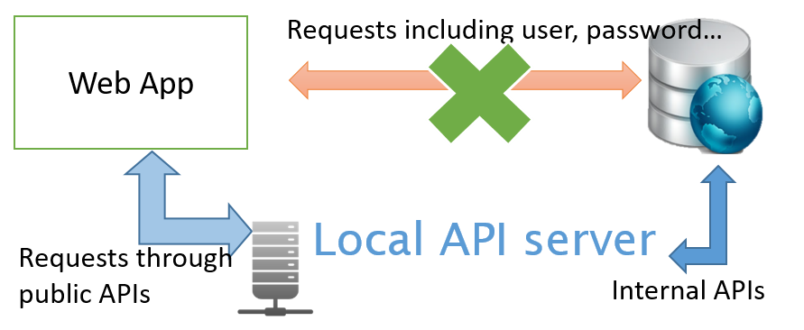

```{r setup, include=FALSE}
library(knitr)
library(magrittr)
library(officedown)
library(officer)
knitr::opts_chunk$set(echo = TRUE)
#officedown issue:60 #https://github.com/davidgohel/officedown/issues/60
fig_zz <- list(
  run_word_field("STYLEREF 1 \\s"),
  ftext("."),
  run_autonum(seq_id = "fig", start_at = 1, pre_label = "", post_label = "")
)
tab_zz <- list(
  run_word_field("STYLEREF 1 \\s"),
  ftext(""),
  run_autonum(seq_id = "table", start_at = 1, pre_label = "", post_label = "")
)
```
<!---BLOCK_TOC{level: 2}--->


\newpage

# Introduction

## An infrastructure for information services of ODB's bio-database

How can we design an infrastructure that help people easier, more safer, more convenient for adding ideas to use the bio-database of Ocean Data Bank (ODB)? ODB is dedicated to help academia to curate and use the databases whose data is mainly collected through marine research vessels which are supported by Ministry of Science and Technology (MOST), Taiwan. The data of ODB is in privacy under the restriction of the data release policies of MOST, and ODB compiles raw data after reviewing someone’s application. This restriction limits open usage of the information services we deliver. To bridge ODB’s information services between open usage and databases is a prerequisite, whereas a well-defined application programming interface (API) is often the answer ([Box 1.1](#box1-1)). In addition, ODB’s information services are usually not for implementing new theory or algorithm on scientific researches, but for helping academia to use data, check data patterns, and create data modeling in their researches. These considerations form the basis for how to construct the infrastructure of information services to use the bio-database of ODB:

::: {.infobox data-latex=""}

:::: {.box_main custom-style="box1_main"}
[Box1.1]{#box1-1}
::::

:::: {custom-style="box1"}

  &check; API is a set of interfacing specifications for machine-to-machine communications. Here we focus on web API, i.e., data transport upon HTTP request/response structure. Most popular web API protocol is REST (Representational State Transfer), and increasingly used, GraphQL API. Commonly used data formats are JSON and XML.

  &check; API can provide a secure way to access the bio-database (internal APIs, Fig. \@ref(fig:fig-webapi)) with authority management. On the other hand, API can also provide open-access methods for public information compiled from the bio-database (public APIs).
  
::::

:::

<br>

::: {.fbox data-latex="" custom-style="fig1"}

```{r fig-webapi, echo=FALSE, message=FALSE, warning=FALSE, fig.id='fig1', label='fig1'}

```
:::

::: {custom-style="Image Caption"}
Fig. `r run_bookmark("fig-webapi", fig_zz)` Simplified schematic for web API of the bio-database
:::

<br>

(1)	Don’t reinvent the wheel: ODB’s information services should be focused on problem solving. “Don’t reinvent the wheel” here means use existing, proven, and open source software (OSS) to get solutions. There are many OSS packages in data manipulation, data visualization, database-engine wrapper, Geographic Information System (GIS) processing, and statistics which are the major fields of data science that used for ecological applications. To be able to add these OSS packages upon the infrastructure in a more flexible way facilitate us to bring ideas into practice.

(2)	Faster development and deployment: It’s practical to design the infrastructure of ODB’s information services under the premise that most of the researchers are not programmers and no need to have background for database when using the data. But the researchers usually have to demonstrate their ideas, to check data patterns, and to modeling their data more efficiently. That’s why we need to have an infrastructure that is suitable for faster development and deployment.

(3)	Scalability, reproducibility, and consistency: To be easier to combine user data with ODB’s data so that the researchers can check data patterns in different scales. It’s also necessary to make the results be reproducible and consistent. 

We present an infrastructure which may fulfill these requirements for constructing ODB’s information services upon (Fig. 1.2). We use R ()


\newpage

```{r, child=c('Re-structuring-bio-database.Rmd')}
```


```{r, child=c('internal_api.Rmd')}
```


```{r, child=c('public_api.Rmd')}
```
