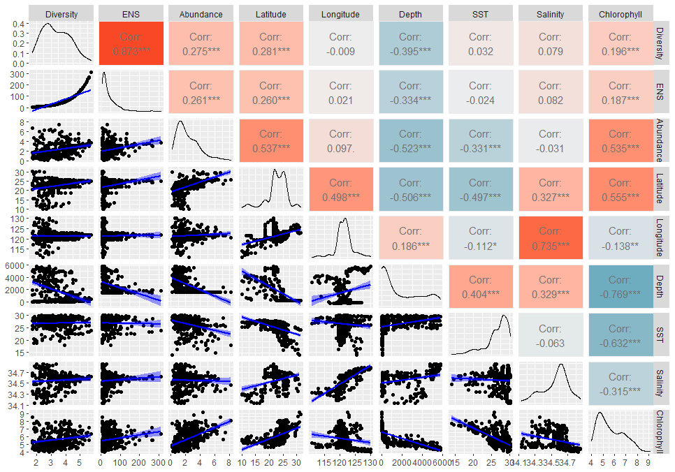

## *A reproducible example using the internal APIs for larval-fish regional biodiversity*

```{r setup_rerun, include=FALSE}
# It's a time-consuming Rmd. If just re-run, no need to evaluate all, just load some saved data
if (FALSE) {
  save(frg1, fdiv, file="data/inext_div_larvalfish_assemblages.RData") #No need to re-write the data
}
USE_SAVED <- TRUE
if (USE_SAVED) {
  load("data/inext_div_larvalfish_assemblages.RData")
}  

```


```{r gridded_larvalfish_data, results="hide", warning=FALSE, message=FALSE}
fd0c <- odbapi::getBio(dbhost = larvaHost, dbuser = odbUser, dbname = larvaDB,
                       mesh_rng = c(200, 1000), taxon ="fish", taxon_lvl = "species", 
                       varname = "metadata_raw", value_unit = "perm3", appends = "all")
fd0z <- odbapi::getBio(dbhost = odbHost, dbuser = odbUser, dbname = odbBioDB, 
                       mesh_rng = c(200, 1000), taxon ="fish", taxon_lvl = "species", 
                       varname = "metadata_raw", value_unit = "perm3", appends = "all")
colx <- intersect(colnames(fd0c), colnames(fd0z))
fd1 <- list(fd0c[,..colx], fd0z[,..colx]) %>% rbindlist(use.names = TRUE, fill = TRUE)
fd1[, c("lng","lat") := 
        odbapi::grdxy_comb(longitude+0.25, latitude+0.25, 1L)] # 0.5-degree gridded
```


```{r set_regional_group, results="hide", warning=FALSE, message=FALSE}
rg = data.frame(x1 = c(109, 109, 118, 121, 118,  121.5,120), #subdivide seas around Taiwan into 6 regions 
                x2 = c(120.5,118,121, 135, 121.5,124,  135),
                y1 = c(18,  21,   21,  18, 24,   24,   26.5), 
                y2 = c(21,  22.5, 24,  24, 26.5, 26.5, 36))

pts_in_grdx <- function(pt,grdx,tor=0) { #tor: tolerance in degree
  x <- pt[[1]]
  y <- pt[[2]]
  grdt <- grdx %>% data.table()
  grdt[,idx := fifelse(x<x2 & x>=x1 & y<y2 & y>=y1,1L,0L)]
  if (length(which(grdt$idx==1L))>=1) {
    return(which(grdt$idx==1L)[1])
  } else {
    grdt[,idx:=fifelse(((x-tor)<x2 & x>=x1 & y<y2 & y>=y1) |
                        (x<x2 & (x+tor)>=x1 & y<y2 & y>=y1) |
                        (x<x2 & x>=x1 & (y-tor)<y2 & y>=y1) |
                        (x<x2 & x>=x1 & y<y2 & (y+tor)>=y1), 1L, 0L)]
    if (length(which(grdt$idx==1L))>=1) {
      return(which(grdt$idx==1L)[1])
    } else {
      return(0L)
    }
  }
}

grdx_in_grp <- function(grdx) {
  x1 <- grdx[[1]]; x2 <- grdx[[2]]
  y1 <- grdx[[3]]; y2 <- grdx[[4]]
  stx<- grdx[[5]]; grp<- grdx[[6]]
  xgrd <- 0.5*((x1*2):((x2+1)*2))
  ygrd <- 0.5*((y1*2):((y2+1)*2))
  data.table(CJ(xgrd[1:(length(xgrd)-1)],ygrd[1:(length(ygrd)-1)],seq(0,3)), stx=stx, grp=grp) %>% 
    setnames(1:3, c("lng","lat","season"))
}

cast_in_grdx <- function (dt, rgt, tor=0.05) {
  for(i in 1:nrow(rgt)) {
    if (i==1) {
      gp0 <- grdx_in_grp(rgt[i,])
    } else {
      gp0 <- rbind(gp0,grdx_in_grp(rgt[i,]))
    }
  }
  gp0[,c("lng1","lat1"):=grdxy_comb(lng, lat, 2)] %>%
    .[,`:=`(lng1x=lng1+0.5, lat1x=lat1+0.5)]
  gpx <- copy(dt) %>% .[,stx:=apply(.[,.(longitude,latitude)],1,pts_in_grdx,grdx=rg, tor=tor)] 
  gpx %<>% merge(rgt[,.(stx,grp)], by="stx", all.x=T)
  gpx[is.na(grp), grp:=0L]
  return(gpx)
}

rgt <- rg %>% setDT() %>% .[,`:=`(stx=.I, grp=rep(c(1,2,2,3:6),each=1))]
rgx <- copy(rgt)
rgx$grp<- factor(rgx$grp,levels=1:6, labels=paste0("grp",1:6))
grpcolt <- scale_colour_manual(name="grp", 
             values=c("0"="#F8766D", "1"="#7CAE00", "2"="#00BFC4", "3"="#C77CFF",
                      "grp1"="forestgreen", "grp2"="cyan", "grp3"="gold",
                      "grp4"="darkorchid1", "grp5"="chartreuse", "grp6"="darkorange",
                      "TRUE"="blue", "FALSE"="red", "CHIU"="black", "ODB"="grey50"))
```

```{r pts_in_groups, results="hide", warning=FALSE, message=FALSE}
if (!USE_SAVED) {
  frg1 <- cast_in_grdx(fd1[,.(longitude, latitude, show_name, taxon_count, season, cast_id, lng, lat)], rgt, tor=0.05) #
  frg1[,grp:=ifelse(stx <= 1, 1, ifelse(stx %in% c(2, 3), 2, stx-1L))] #%>% ######### combine grp1 and grp2 
  setnames(frg1, ncol(frg1), "polyID")
  #print(table(frg1$polyID))
  #    1     2     3     4     5     6 
  # 1169  4422  3782  9598 20783   297 
}
fgrdx <- unique(frg1[,.(lng,lat,season)]) %>% setorder(lng,lat,season) %>% .[,xid:=.I]
#table(fgrdx$season)
```

```{r plot_region, eval=FALSE, results="hide", message=FALSE, warning=FALSE}
if (!USE_SAVED) {
  g1 <- exapi::bioquery(return_type = "site2map", datasrc=frg1, data_group="polyID") #plot on map
}

```

```{r avg_abund_for_sp, results="hide", message=FALSE, warning=FALSE}
fd05 <- frg1 %>%
        .[,{.(val = mean(taxon_count*1000), #mean aboundance for species, if sum-up it, will maximum dominance of some sp
              logv= log(mean(taxon_count*1000)), #logv is the log(1000 * taxonomic abundance)
              spn = length(unique(show_name)), 
              nsz = length(unique(cast_id))
          )}, by = .(lng,lat, season, polyID, show_name)]
```

```{r bio_compo, results="hide", warning=FALSE, message=FALSE}
fd2 <- data.table::dcast(fd05, lng+lat+season+polyID ~ show_name, 
                          function(x) {
                            round(log(mean(x, na.rm=T)*10),0) 
                          },value.var="val",fill=0) %>%
  merge(fgrdx, by=c("lng","lat","season"), all.x=T) %>%
  .[, .SD, .SDcols=c("polyID",colnames(.)[1:3],"xid",colnames(.)[5:(ncol(.)-1)])] %>%
  setnames(2:3, c("longitude", "latitude"))
```

``` {r exapi_bioquery, eval=FALSE, results="hide", message=FALSE, warning=FALSE}
if (!USE_SAVED) {
  g2 <- exapi:::compo_divx(data=fd2, poly=1:6L, hasPoly=TRUE) #it works, but too slow to generate docx, so only run once to get plot
}

```


``` {r compo_stats, results="hide", message=FALSE, warning=FALSE}
if (!USE_SAVED) {
  fdiv <- exapi:::compo_divx(data = fd2, poly = 1:6L, hasPoly=TRUE, return_type = "community_stats")
}

```

::: {custom-style="Table Caption"}
Table `r run_bookmark("iNext_diversity_table", tab_zz)` Bio-diversity evaluated by iNEXT
:::

```{r iNext_diversity_table, echo=FALSE, tab.id='iNext_diversity_table', label='iNext_diversity_table'}
head(fdiv)
```


``` {r merge_div, results="hide", warning=FALSE, message=FALSE}
fcom <- merge(fd2[,1:5], 
              frg1 %>% .[,{.(logv=log(mean(taxon_count*1000)))}, by=.(lng, lat, season, polyID)] %>% 
                      setnames(1:2, c("longitude", "latitude")), 
              by=c("longitude", "latitude", "season", "polyID"), all.x=TRUE) %>% 
          merge(fdiv, by=c("longitude", "latitude", "season", "polyID"), all = TRUE)
  
```


```{r getEnv, results="hide", warning=FALSE, message=FALSE}
woa <- odbapi::getEnv(dbhost = odbHost, dbuser = odbUser, dbname = "bioenv",
                      tblname = "noaa_woa_v2013", varname = c("nitrate", "phosphate", "silicate"), grd_env = 2)
dep <- odbapi::getDepth(dbhost = odbHost, dbuser = odbUser, varname=c("sea_depth"), grd_env = 1)
neo <- odbapi::getEnv(dbhost = odbHost, dbuser = odbUser, dbname = "bioenv",
                      tblname = "nasa_neo", varname = c("sst", "chl"), grd_env = 1,
                      lng_rng = c(min(fd1$longitude)-0.75, max(fd1$longitude)+0.75),
                      lat_rng = c(min(fd1$latitude)-0.75, max(fd1$latitude)+0.75)) 
godas <- odbapi::getEnv(dbhost = odbHost, dbuser = odbUser, dbname = "bioenv",
                      tblname = "ncep_godas", varname = c("salinity"), grd_env = 1,
                      lng_rng = c(min(fd1$longitude)-0.75, max(fd1$longitude)+0.75),
                      lat_rng = c(min(fd1$latitude)-0.75, max(fd1$latitude)+0.75)) 

#ctd <- odbapi::getEnv(dbhost = odbHost, dbuser = odbUser, dbname = "bioenv",
#                      tblname = "ctd_odb", varname = c("temperature", "salinity", "fluorescence"), grd_env = 1,
#                      lng_rng = c(min(fd1$longitude)-0.75, max(fd1$longitude)+0.75),
#                      lat_rng = c(min(fd1$latitude)-0.75, max(fd1$latitude)+0.75))

```

```{r comm_env, results="hide", warning=FALSE, message=FALSE}
env <- merge(godas, neo[, chla:=log(chl*1000)], by=c("longitude", "latitude", "season"), all=TRUE) %>%
  merge(dep, by=c("longitude", "latitude"), all=TRUE)

fcomx <- merge(fcom, env, by=c("longitude", "latitude", "season"), all.x=TRUE)

#cor.test(fcomx$div_inxt,fcomx$logv) #all sig
#cor.test(fcomx$spn_inxt,fcomx$chla) 
#cor.test(fcomx$logv, fcomx$sst) 
#cor.test(fcomx$logv, fcomx$chl) #sig but not sig for cor.test(fcomx$div_inxt, fcomx$chl) 
#cor.test(fcomx$spn_inxt, fcomx$sea_depth) 

```


```{r prepare_corr_with_env, results="hide", warning=FALSE, message=FALSE}

my_fn1 <- function(data, mapping, ...){
  p <- ggplot(data = data, mapping = mapping) + 
    geom_point() + 
    #geom_smooth(method=loess, fill="red", color="red", ...) +
    geom_smooth(method=lm, fill="blue", color="blue", ...)
  p
}

fstat <- fcomx[,.(div_inxt,h1_inxt,logv,latitude,longitude,sea_depth,sst,salinity,chla)] %>%
  setnames(1:ncol(.),c("Diversity","ENS","Abundance","Latitude","Longitude","Depth","SST","Salinity","Chlorophyll"))

```

::: {custom-style="Table Caption"}
Table `r run_bookmark("community_stats_table", tab_zz)` Larval-fish assemblages with environments
:::

```{r community_stats_table, echo=FALSE, tab.id='community_stats_table', label='community_stats_table'}
head(fstat)
```


```{r pairwise_correlation_with_env, eval=FALSE, results="hide", warning=FALSE, message=FALSE}
if (USE_SAVED) {
  #
} else {
  library(GGally) ## ggpairs combine with ggcorr
  library(ggplot2)

  p1 <- ggpairs(fstat, columns = 1:ncol(fstat), lower = list(continuous = my_fn1)) #list(continuous = "smooth"))   
  # Correlation matrix plot
  p2 <- ggcorr(fstat, label = TRUE, label_round = 2, label_alpha = TRUE)

  # Get list of colors from the correlation matrix plot
  g2 <- ggplotGrob(p2)
  colors <- g2$grobs[[6]]$children[[3]]$gp$fill

# Change background color to tiles in the upper triangular matrix of plots 
  idx <- 1
  p<- ncol(fstat)
  for (k1 in 1:(p-1)) {
    for (k2 in (k1+1):p) {
      plt <- getPlot(p1,k1,k2) +
        theme(panel.background = element_rect(fill = colors[idx], color="white"),
              panel.grid.major = element_line(color=colors[idx]))
      p1 <- putPlot(p1,plt,k1,k2)
      idx <- idx+1
    }
  }
  print(p1)
}

```


